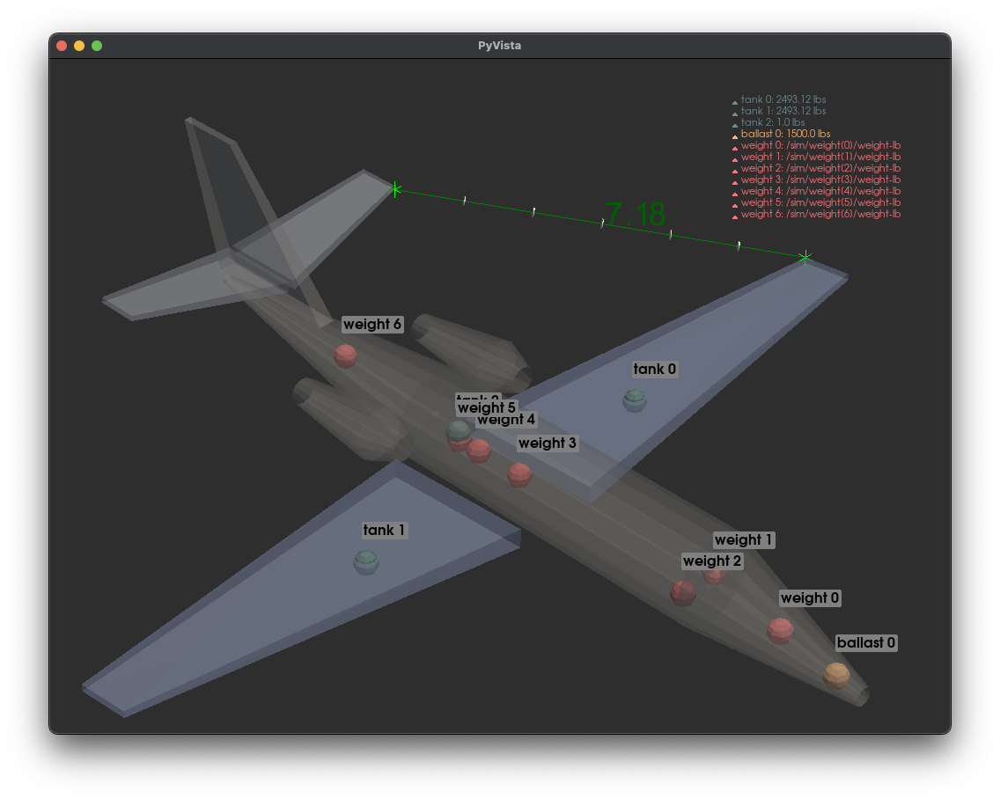

# YASimViz
A Python tool for visualizing YASim flight model XML data in 3D, using PyVista for interactive component inspection and analysis.

## Features

- **3D Visualization**: Render and inspect critical aircraft components including fuselages, wings, horizontal stabilizers, vertical stabilizers, mirrored stabilizers, tanks, ballasts, and weights in an interactive 3D environment.
- **Background Image Integration**: Align your flight model with background images of real aircraft, enabling precise shaping and verification of the model against actual aircraft profiles.
- **Customizable Appearance**: Adjust transparency and colors to tailor the visualization to your needs and preferences.
- **Interactive Controls**: Rotate, zoom, and reset the view to inspect the model from various angles and distances.
- **Component Labels**: Optionally display labels for different components to facilitate identification and analysis.
- **Support for Various Components**: Visualize different types of components such as fuselages, wings, and stabilizers, as well as weight elements like tanks and ballasts.
- **Measurement Widget**: Use the measurement widget to interactively measure distances between two points with left mouse clicks. Toggle the widget on and off using the `m` key to avoid accidental measurements and keep the interface uncluttered.
- **Easy Integration**: Seamlessly visualize YASim XML flight model data with minimal setup and configuration.



## Requirements

- Python 3.x
- `pyvista` library
- `numpy` library

## Installation

1. **Clone the repository**:

    ```bash
    git clone https://github.com/MrChillStorm/YASimViz.git
    cd YASimViz
    ```

2. **Install dependencies**:

    ```bash
    pip3 install pyvista numpy
    ```

## Usage

Run the script with the required arguments to visualize your YASim flight model:

```bash
python3 yasimviz.py <xml_file> [options]
```

### Arguments

- `xml_file`: Path to the YASim XML file.
- `-l` or `--labels`: Display labels for components.
- `-t` or `--transparency`: Make objects semi-transparent.
- `-w` or `--weights`: Display weight elements.
- `-b` or `--background-image`: Path to a background image file.

### Examples

1. **Visualize without point labels and transparency**:

    ```bash
    python3 yasimviz.py path/to/your/aircraft-yasim.xml
    ```

2. **Visualize with point labels**:

    ```bash
    python3 yasimviz.py path/to/your/aircraft-yasim.xml -l
    ```

3. **Visualize with weight elements**:

    ```bash
    python3 yasimviz.py path/to/your/aircraft-yasim.xml -w
    ```

4. **Visualize with a custom background image and semi-transparency**:

    ```bash
    python3 yasimviz.py path/to/your/aircraft-yasim.xml -t -b path/to/background.jpg
    ```

## Functionality

### XML Parsing

The script parses the YASim XML file to extract data related to various aircraft components. It uses default values for attributes not specified in the XML.

### Component Visualization

1. **Fuselages**: Rendered as tapered cylinders with circular cross-sections at the front, middle, and back.
2. **Wings and Stabilizers**: Rendered with options for sweep, dihedral, incidence, and twist.
3. **Tanks, Ballasts, and Weights**: Rendered as spheres. Legends show the mass or capacity of these components.

### Interactive Keyboard Controls

- **`c`**: Reset view to head-on from the positive x-axis.
- **`x`**: Rotate view around the x-axis.
- **`y`**: Rotate view around the y-axis.
- **`z`**: Rotate view around the z-axis.
- **Up Arrow**: Zoom in.
- **Down Arrow**: Zoom out.
- **`t`**: Cycle transparency in increments of 0.1.
- **`m` Key**: Toggles the measurement widget on and off.

## Code Overview

- **`parse_yasim_file(file_path)`**: Parses the YASim XML file and returns a dictionary of components.
- **`generate_fuselage_vertices_and_faces(fuselage)`**: Generates vertices and faces for fuselage components.
- **`generate_component_vertices_and_faces(component, component_type)`**: Generates vertices and faces for other components.
- **`visualize_with_pyvista(components, ...)`**: Visualizes components using PyVista with customizable options.
- **`main()`**: Parses command-line arguments and initiates visualization.

## Contributing

Contributions are welcome! Please open an issue or submit a pull request on GitHub.

## License

This project is licensed under the GPL-2.0 License. See the [LICENSE](LICENSE) file for details.
